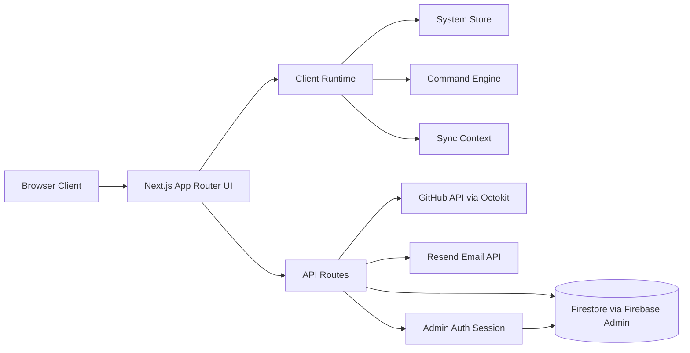
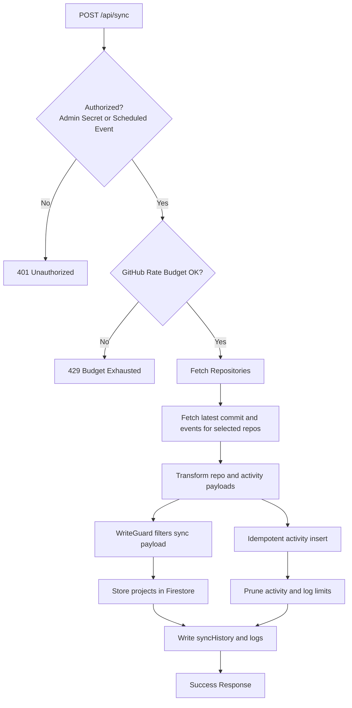

# Retro Portfolio

[](https://nextjs.org/)
[](https://react.dev/)
[](https://www.typescriptlang.org/)
[](https://firebase.google.com/)
[](#license)

A high-fidelity, CRT-themed interactive portfolio built with Next.js App Router. It combines narrative UI, live terminal interactions, mini-games, GitHub-driven project sync, and a secured admin runtime for manual content control.

## Table of Contents

- [Project Overview](#project-overview)
- [Key Features](#key-features)
- [Target Audience and Use Cases](#target-audience-and-use-cases)
- [Tech Stack](#tech-stack)
- [Architecture and Design](#architecture-and-design)
- [Project Structure](#project-structure)
- [API Documentation](#api-documentation)
- [Configuration](#configuration)
- [Installation and Setup](#installation-and-setup)
- [Usage](#usage)
- [Testing](#testing)
- [Deployment](#deployment)
- [Contributing](#contributing)
- [License](#license)
- [Assumptions and Notes](#assumptions-and-notes)

## Project Overview

`Retro Portfolio` is a portfolio platform that presents profile, project archive, system diagnostics, and communication modules through a simulated retro operating system interface.

It solves two common portfolio problems:

- Static portfolios are hard to personalize and remember.
- Dynamic portfolio content often lacks a safe admin/sync model.

This project addresses both with:

- A stylized terminal-first UI with anomaly and 404 gameplay mode.
- A GitHub sync pipeline that enriches project data.
- Manual field ownership boundaries so sync jobs cannot overwrite admin-curated content.
- Firestore-backed persistence for projects, activities, logs, site config, and leaderboards.

## Key Features

- Immersive CRT shell UI with boot sequence, scanlines, and adaptive performance modes.
- Multi-page content modules: `HOME`, `PROFILE`, `ARCHIVE`, `UPLINK`, `SYSTEM`, optional `ADMIN`.
- Built-in mini games: `snake`, `pong`, `runner`, `memory`.
- Firestore leaderboard API for top-10 score tracking per game.
- Uplink contact API with Resend email delivery, sanitization, and in-memory rate limiting.

Command runtime capabilities:

- Global command palette (`Ctrl/Cmd + K`)
- Full terminal command engine with aliases and action dispatch
- 404 anomaly terminal with recovery and game commands

GitHub sync capabilities:

- Fetch repos and events via Octokit
- Transform and prioritize repository data
- Preserve manual fields via write guard filtering
- Activity/event idempotency and collection pruning

Admin runtime capabilities:

- Firestore-backed credential verification (`bcryptjs` hash)
- JWT session cookie
- Admin-only APIs protected by middleware and session checks
- Project, site, and profile editors with controlled manual writes

## Target Audience and Use Cases

- Developers building a highly customized portfolio UI.
- Engineers who need mixed auto-sync and manual editorial control.
- Creators who want playful interaction (terminal and games) without giving up structured content management.

Typical use cases:

- Personal portfolio with GitHub auto-ingestion and manual curation.
- Developer landing site with retro branding and interactive diagnostics.
- Showcase app demonstrating Next.js App Router plus Firebase Admin patterns.

## Tech Stack

### Core

- Next.js `16.2.4` (App Router)
- React `19.2.4`
- TypeScript `5.x`

### UI and Rendering

- Tailwind CSS `4.x` (CSS-first config in `app/globals.css`)
- Framer Motion `12.38.0`
- Three.js `0.184.0`
- `@react-three/fiber` `9.6.0`
- `@react-three/drei` `10.7.7`

### Backend and Integrations

- Firebase Admin SDK `13.8.0` (Firestore)
- Octokit REST `22.0.1` (GitHub API)
- Resend `6.12.2` (email)
- JOSE `6.2.2` (JWT)
- bcryptjs `3.0.3` (password hash compare)

### Tooling

- ESLint `9` plus `eslint-config-next`
- PostCSS plus `@tailwindcss/postcss`

## Architecture and Design

### System Architecture



### Sync Pipeline Flow



### Command and Mode Relationships

```mermaid
flowchart LR
  A[User Input] --> B[CommandTerminal or AnomalyTerminal]
  B --> C[commandEngine.process]
  C --> D[COMMAND_REGISTRY]
  D --> E[Action Output]

  E --> F[Navigate]
  E --> G[Launch Game]
  E --> H[Leaderboard Query]
  E --> I[Sync Trigger]

  F --> J[systemStore mode and route updates]
  G --> K[Game Components]
  K --> L[/api/leaderboard]
```

### Data Ownership Strategy

- GitHub-sourced fields are sync-owned.
- Manual/admin fields are admin-owned.
- `writeGuard` enforces directional filtering.
- Sync writes cannot mutate manual fields.
- Admin update APIs only accept whitelisted manual fields.

## Project Structure

```text
.
├─ app/
│  ├─ api/
│  │  ├─ admin/                 # Authenticated admin endpoints
│  │  ├─ leaderboard/route.ts   # Game score read/write
│  │  ├─ projects/route.ts      # Public project fetch
│  │  ├─ site-config/route.ts   # Public site config fetch
│  │  ├─ sync/route.ts          # GitHub -> Firestore sync engine
│  │  └─ uplink/route.ts        # Contact/email relay
│  ├─ admin/                    # Admin runtime page
│  ├─ archive/                  # Project archive UI
│  ├─ profile/                  # Profile page UI
│  ├─ system/                   # Diagnostics plus terminal plus controls
│  ├─ uplink/                   # Contact terminal UI
│  ├─ layout.tsx                # Root providers plus shell
│  ├─ not-found.tsx             # Anomaly mode trigger
│  └─ page.tsx                  # Home page
├─ components/
│  ├─ admin/                    # Project/site/profile editors
│  ├─ games/                    # Snake, Pong, Runner, Memory
│  ├─ system/                   # Sync system panel components
│  ├─ AppShell.tsx              # Global shell plus boot plus anomaly handling
│  ├─ CommandTerminal.tsx       # Main command runtime
│  └─ AnomalyTerminal.tsx       # 404 emergency terminal runtime
├─ context/
│  ├─ SystemContext.tsx         # Device/performance/audio/CRT state
│  └─ SyncContext.tsx           # Sync status, logs, trigger flow
├─ lib/
│  ├─ admin/                    # Session plus password helpers
│  ├─ command/                  # Command types, registry, engine
│  ├─ safety/                   # Validation, write guard, limits, logging
│  ├─ sync/                     # Fetch, transform, score, persistence pipeline
│  ├─ leaderboard.ts            # Leaderboard client helpers
│  ├─ soundEngine.ts            # UI audio engine
│  └─ useSiteConfig.ts          # Site config hook and cache
├─ scripts/
│  ├─ generate_admin_hash.js    # Create bcrypt hash for admin password
│  └─ seedFirestore.mjs         # Seed siteConfig plus starter project docs
├─ store/useSystemStore.ts      # Global runtime and admin mode store
├─ utils/
│  ├─ firestore.ts              # Firebase Admin init plus helper writes
│  └─ github.ts                 # Octokit plus rate budget check
├─ firestore.rules              # Firestore security rules
└─ middleware.ts                # /api/admin/* JWT gate
```

## API Documentation

### Public APIs

#### `GET /api/projects`

Returns all project documents from Firestore, with Firestore doc id mapped to `repoId`.

Example response:

```json
[
  {
    "repoId": "123456",
    "name": "retro-portfolio",
    "displayName": "Retro Portfolio",
    "isHidden": false
  }
]
```

#### `GET /api/site-config`

Returns merged site configuration from multiple `siteConfig/*` docs.

#### `GET /api/leaderboard?game=snake`

Returns top 10 scores for one game (`snake | pong | runner | memory`).

Example response:

```json
{
  "game": "snake",
  "scores": [
    { "name": "ANON", "score": 120, "timestamp": 1760000000000 }
  ]
}
```

#### `POST /api/leaderboard`

Body:

```json
{
  "game": "snake",
  "name": "PLAYER1",
  "score": 120
}
```

Response:

```json
{
  "success": true,
  "isHighScore": true
}
```

#### `POST /api/uplink`

Sends contact payload via Resend. Includes in-memory IP rate limiting and HTML escaping.

Body:

```json
{
  "source": "USER_HANDLE",
  "node": "user@example.com",
  "type": "MESSAGE",
  "packet": "Hello from uplink"
}
```

### Sync API

#### `POST /api/sync`

Triggers GitHub sync pipeline. Requires either:

- `Authorization: Bearer <ADMIN_SYNC_SECRET>`
- `x-github-event: schedule`

### Admin APIs

All admin routes are under `/api/admin/*` and gated by middleware plus session checks.

- `POST /api/admin/login`
- `POST /api/admin/logout`
- `GET /api/admin/projects`
- `PATCH /api/admin/project/update`
- `GET /api/admin/site-config?doc=<allowedDoc>`
- `PATCH /api/admin/site-config`
- `GET /api/admin/profile/update`
- `PATCH /api/admin/profile/update`
- `GET /api/admin/sync`
- `POST /api/admin/sync`

## Configuration

Create `.env.local` in project root.

```bash
# Required: Firebase Admin JSON (single-line JSON string)
FIREBASE_SERVICE_ACCOUNT='{"type":"service_account",...}'

# Required for GitHub sync
GITHUB_TOKEN=ghp_xxx

# Required for sync authorization plus JWT signing secret
ADMIN_SYNC_SECRET=replace-with-strong-random-secret

# Required for uplink email relay
RESEND_API_KEY=re_xxx

# Optional (fallback exists in code)
CONTACT_EMAIL=you@example.com
```

### Firestore Collections Used

- `projects`
- `activities`
- `siteConfig`
- `leaderboards/{game}/scores`
- `syncHistory`
- `systemLogs`
- `profile/main`
- `internal/config` (admin credentials)

## Installation and Setup

### Prerequisites

- Node.js `20+` recommended
- npm `10+`
- Firebase project with Firestore enabled

### 1. Install dependencies

```bash
npm install
```

### 2. Install missing direct dependency used in source

```bash
npm install zod
```

### 3. Configure environment

Create `.env.local` using the variables shown above.

### 4. Seed Firestore site data

```bash
node scripts/seedFirestore.mjs
```

### 5. Initialize admin credentials document

Generate a password hash:

```bash
node scripts/generate_admin_hash.js <your_password>
```

Then create Firestore document:

- Path: `internal/config`
- `adminUser`: your username
- `adminPasswordHash`: generated bcrypt hash

### 6. Start development server

```bash
npm run dev
```

App default: `http://localhost:3000`

## Usage

### Main UI routes

- `/` Home
- `/profile`
- `/archive`
- `/uplink`
- `/system`
- `/admin` (shown/usable after admin runtime activation)

### Terminal commands (core)

- `help`
- `status`
- `home`
- `admin`
- `logout`
- `sync` (admin only)
- `play snake|pong|runner|memory`
- `leaderboard snake|pong|runner|memory`
- `clear`
- `fix` (anomaly mode context)

### Admin workflow

1. Enter command `admin` from terminal.
2. Authenticate on `/admin`.
3. Edit project manual fields and site config docs.
4. Trigger sync from system panel or terminal command `sync`.

### Utility scripts

```bash
# Environment diagnosis helper
node check-env.js

# Optional wrapper for dev server launch
node dev.js
```

## Testing

There is currently no automated test suite configured in `package.json`.

Recommended interim checks:

Run lint:

```bash
npm run lint
```

Manually verify:

- public routes render
- admin login/logout flow
- sync trigger and `syncHistory` updates
- leaderboard read/write for all 4 games
- uplink API send path

## Deployment

### App deployment (recommended: Vercel)

1. Import repository into Vercel.
2. Configure all `.env.local` variables in project settings.
3. Deploy.

### Firestore rules deployment

`firebase.json` points to `firestore.rules`.

```bash
firebase deploy --only firestore:rules
```

### Production notes

- Ensure `ADMIN_SYNC_SECRET` is strong and unique.
- Verify `FIREBASE_SERVICE_ACCOUNT` has minimum required privileges.
- If running multiple instances, replace in-memory API rate limit maps with persistent/shared storage (for example Redis).

## Contributing

1. Fork and create a feature branch.
2. Keep UI behavior and system-theme conventions consistent.
3. Preserve write ownership boundaries (`lib/safety/writeGuard.ts`).
4. Run lint and manual flow checks before opening a PR.
5. Provide screenshots or short recordings for UI-impacting changes.

## License

No license file currently exists in this repository.

Suggested: `MIT License` for open-source publication.

## Assumptions and Notes

- `zod` is imported in `lib/safety/validation.ts` but is not declared in `package.json` at the time of writing.
- The current Firestore rules allow broad public read access to selected collections by design.
- API rate limiting in `uplink` and admin login routes uses in-memory maps, which reset on process restart and do not coordinate across replicas.
- Current badges include a license badge suggestion; add a real `LICENSE` file to make it authoritative.
